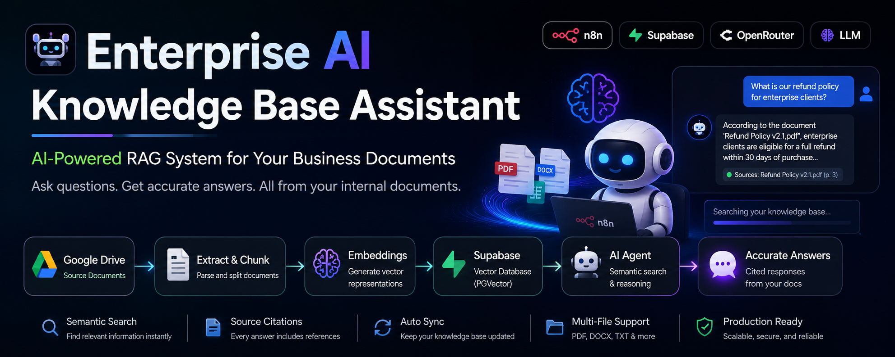
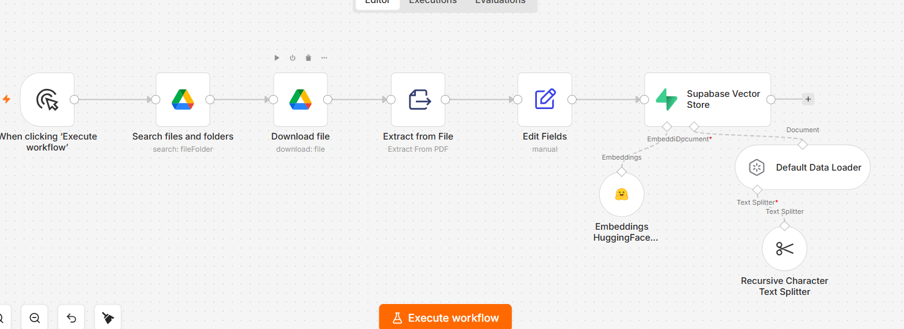
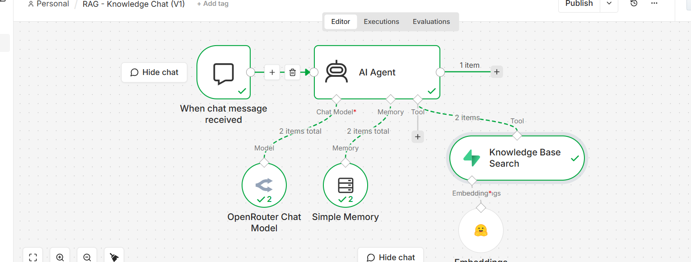

<p align="center">
  
</p>

# 🤖 Enterprise AI Knowledge Base Assistant

> **Version 1.0** — An AI-powered Retrieval-Augmented Generation (RAG) system that enables businesses to chat with their internal documents using natural language.


---

# 💼 Business Problem

Most companies store valuable business knowledge inside PDF documents.

These documents usually contain:

- Services
- Pricing
- Internal documentation
- Company policies
- FAQs
- Product documentation
- Employee knowledge

As businesses grow, searching through dozens of PDF files becomes slow and inefficient.

Support teams spend unnecessary time searching for information instead of helping customers.

This results in:

- Slow customer support
- Inconsistent answers
- Reduced productivity
- Repeated manual work
- Difficult employee onboarding
- Poor knowledge accessibility

Traditional keyword search is also limited because users rarely know the exact wording inside documents.

---

# 📈 Business Impact

This solution transforms static company documents into an intelligent AI assistant capable of retrieving accurate business information in seconds.

Instead of searching through multiple files, employees simply ask questions in natural language and receive grounded answers directly from company documentation.

The result is:

- Faster customer support
- Better employee productivity
- Consistent answers
- Reduced manual searching
- Easier access to company knowledge

---

# 🚀 Solution

The system automatically creates an AI-powered knowledge base by:

1. Searching company PDF files inside Google Drive.
2. Downloading and extracting document content.
3. Splitting documents into semantic chunks.
4. Generating vector embeddings.
5. Storing embeddings inside Supabase Vector Store.
6. Retrieving relevant information using semantic similarity search.
7. Allowing an AI Agent to answer questions based only on retrieved company knowledge.

Unlike a traditional chatbot, the assistant does **not rely on general AI knowledge**.

Instead, every answer is generated using the retrieved business documentation.

---

# 🎬 Demo

## Example Question

```text
How much does SmartSoft ERP development cost?
```

## Example Response

```text
According to the SmartSoft knowledge base,
ERP System Development starts from $5,000.
```

---


---

# 🏗️ System Architecture

```text
                 KNOWLEDGE SYNCHRONIZATION

Google Drive
      │
      ▼
Search PDF Files
      │
      ▼
Download Files
      │
      ▼
Extract PDF Text
      │
      ▼
Prepare Documents
      │
      ▼
Split Into Chunks
      │
      ▼
Generate Embeddings
      │
      ▼
Supabase Vector Database


                   AI KNOWLEDGE CHAT

User Question
      │
      ▼
AI Agent
      │
      ▼
Knowledge Base Search
      │
      ▼
Semantic Vector Search
      │
      ▼
Retrieve Relevant Chunks
      │
      ▼
Grounded AI Response
```

---

# ✨ Key Features

- AI-powered document search
- Retrieval-Augmented Generation (RAG)
- Semantic search using embeddings
- Google Drive integration
- Automatic PDF extraction
- Supabase Vector Database
- Hugging Face Embeddings
- OpenRouter AI Agent
- Multi-document retrieval
- Conversation memory
- Accurate document-grounded responses

---

# 🛠 Technology Stack

| Technology | Purpose |
|------------|----------|
| n8n | Workflow Automation |
| Supabase | Vector Database |
| pgvector | Semantic Search |
| Hugging Face | Embedding Generation |
| Google Drive | Document Storage |
| OpenRouter | Language Model |
| AI Agent | Tool Calling |
| RAG | Knowledge Retrieval |

---

# 🔄 Workflows

## Knowledge Synchronization

- Search PDF files
- Download documents
- Extract text
- Split into chunks
- Generate embeddings
- Store vectors



---

## AI Knowledge Chat

- Receive user question
- Generate query embedding
- Search vector database
- Retrieve relevant chunks
- Generate grounded answer



---

# 📁 Repository Structure

```text
AI-Knowledge-Base-Assistant-RAG

README.md
LICENSE

images/
workflows/
sample-documents/
```

---

# 🛣️ Roadmap

### Version 2

- Automatic document synchronization
- Detect newly uploaded documents
- Update changed documents automatically
- Duplicate detection
- Metadata filtering
- Multiple knowledge bases
- DOCX support
- Website indexing
- Production deployment

---

# 👨‍💻 Author

**Adel Sheded**

AI Automation Developer

Specialized in:

- AI Agents
- n8n Automation
- RAG Systems
- API Integrations
- Workflow Automation

---

# 📄 License

MIT License

---

> **Note:** This repository uses fictional company documents for demonstration purposes. API keys, credentials, and sensitive configuration have been removed before publishing.
